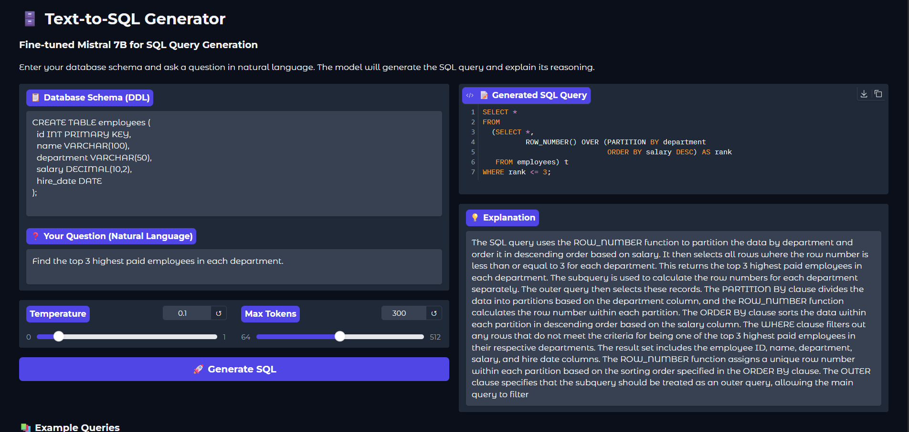
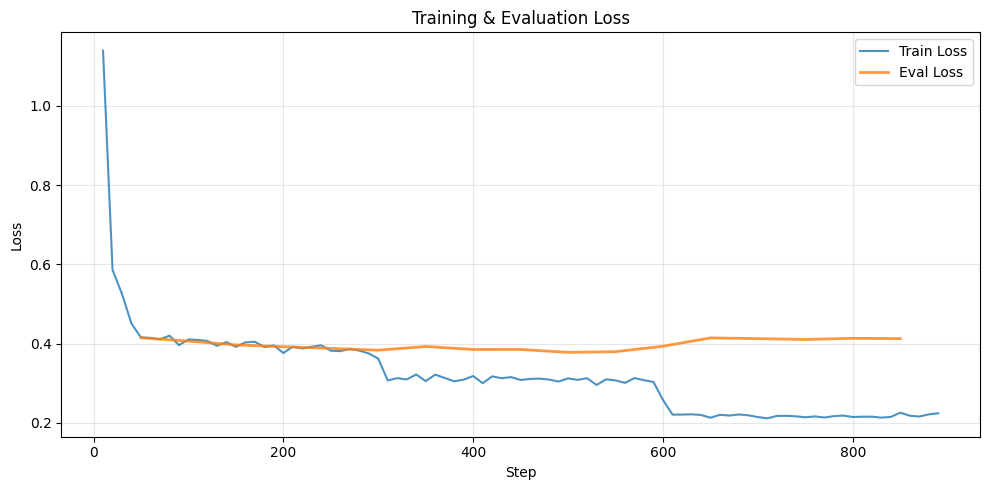

# Mistral 7B Fine-Tuning for Text-to-SQL Generation

Fine-tuning Mistral 7B Instruct v0.3 to convert natural language questions into SQL queries using QLoRA on Gretel's Synthetic Text-to-SQL dataset — trained on a single A100 GPU in ~61 minutes.

---

## Demo
> Replace with your Gradio screenshot


Users input a database schema (DDL) and a natural language question → model generates the SQL query + a structured explanation.

---

## Results

### Training
| Metric | Value |
|---|---|
| Training Loss | 0.42 → 0.21 (over 891 steps) |
| Validation Loss | Stabilized at ~0.42 |
| Training Time | ~61 minutes on A100 GPU |
| LoRA Adapter Size | ~50MB |

> Add your loss curve screenshot here


### Performance: Base vs Fine-Tuned
| Metric | Base Model | Fine-Tuned | Improvement |
|---|---|---|---|
| Exact Match (SQL) | 0.11 | 0.33 | +200% |
| Keyword F1 (SQL) | 0.73 | 0.80 | +10.1% |
| Structural Similarity | 0.95 | 0.95 | +0.7% |
| ROUGE-1 (Explanation) | 0.00 | 0.36 | New capability |
| ROUGE-2 (Explanation) | 0.00 | 0.23 | New capability |
| ROUGE-L (Explanation) | 0.00 | 0.28 | New capability |

**Key insight:** SQL exact match nearly tripled (+200%), and the fine-tuned model learned to generate structured explanations — a capability entirely absent in the base model.

---

## Architecture

```
Mistral 7B Instruct v0.3 (frozen, 4-bit NF4 quantized)
            ↓
LoRA Adapters (r=16, alpha=32) ← only these are trained (~1.1% of params)
            ↓
Fine-tuned on Gretel Synthetic Text-to-SQL (4,750 train / 250 val / 100 eval)
            ↓
Gradio Demo → [Schema + Natural Language] → SQL Query + Explanation
```

---

## Training Configuration
| Parameter | Value |
|---|---|
| Base Model | Mistral-7B-Instruct-v0.3 |
| Quantization | 4-bit NF4 (BitsAndBytes) |
| LoRA Rank (r) | 16 |
| LoRA Alpha | 32 |
| LoRA Targets | q_proj, k_proj, v_proj, o_proj, gate_proj, up_proj, down_proj |
| Trainable Parameters | 41.9M / 3.78B (1.10%) |
| Epochs | 3 |
| Batch Size | 8 (2 × 4 gradient accumulation) |
| Learning Rate | 2e-4 (cosine schedule) |
| Dataset Size | 5,000 samples (4,750 train / 250 val) |
| GPU Memory | ~28GB → ~5GB (86% reduction via QLoRA) |

---

## Key Features
- 4-bit NF4 quantization reduces GPU memory from ~28GB to ~5GB
- Only 1.10% of parameters trained via LoRA adapters — full 7B model never updated
- Prompt format uses Mistral instruct template with system prompt, schema, and question
- Fine-tuned model saved as lightweight ~50MB LoRA adapter for easy portability
- Interactive Gradio demo with temperature and max token controls

---

## Tech Stack
| Component | Technology |
|---|---|
| Base Model | Mistral-7B-Instruct-v0.3 |
| Fine-tuning | QLoRA (PEFT) |
| Quantization | BitsAndBytes (4-bit NF4) |
| Framework | PyTorch + Hugging Face Transformers |
| Dataset | Gretel Synthetic Text-to-SQL (HuggingFace) |
| Demo UI | Gradio |
| Training Environment | Google Colab (A100 GPU) |

---

## Setup & Usage

### Run on Google Colab
[](https://colab.research.google.com/drive/1VzMtcsfLS5leEteYt1YIxSb7Y_NUDl26?usp=sharing)

> **Note:** The fine-tuned LoRA adapter (~50MB) is stored in Google Drive. The notebook automatically mounts Drive, locates the adapter, and loads it on top of the quantized base model.

**To train from scratch:**
1. Set Colab runtime to **A100 GPU** (Colab Pro required)
2. Run all cells sequentially — training takes ~61 minutes
3. The adapter is auto-saved to your Google Drive after training
4. Gradio demo launches in the final cell

**To run inference only (skip training):**
1. Ensure the saved adapter exists in your Google Drive (`MyDrive/mistral-text-to-sql/`)
2. Run the Drive mount + model loading cell — it locates and copies the adapter locally
3. Run the Gradio cell — demo launches immediately without retraining

### Model Loading Flow
```
Google Drive (adapter ~50MB)
        ↓  drive.mount + cp
Local Colab (/content/mistral-text-to-sql)
        ↓  PeftModel.from_pretrained
Mistral 7B base (4-bit quantized) + LoRA adapter
        ↓
Gradio Demo
```

---

## Requirements
```
torch
transformers
peft
bitsandbytes
datasets
gradio
accelerate
trl
```

---

## Sample Outputs
| Natural Language Question | Generated SQL |
|---|---|
| "Find the top 3 highest paid employees in each department" | `SELECT dept, name, salary FROM employees WHERE RANK() OVER (PARTITION BY dept ORDER BY salary DESC) <= 3` |
| "Total sales by product category" | `SELECT category, SUM(sales) FROM products GROUP BY category` |
| "Show all customers from New York" | `SELECT * FROM customers WHERE city = 'New York'` |

---

## Future Work
- Train on the full 100K Gretel dataset for enhanced performance
- Evaluate using SQL execution accuracy (not just exact match)
- Explore DPO (Direct Preference Optimization) for further alignment

---

## Project Structure
```
mistral-7b-text2sql-finetuning/
├── mistral_text2sql_finetuning.ipynb   # Main Colab notebook
├── requirements.txt
├── assets/
│   ├── gradio_demo.png                 # Gradio interface screenshot
│   └── training_loss.png              # Training & eval loss curve
└── README.md
```

---

## References
- [Mistral 7B](https://huggingface.co/mistralai/Mistral-7B-Instruct-v0.3)
- [QLoRA Paper](https://arxiv.org/abs/2305.14314)
- [PEFT Library](https://github.com/huggingface/peft)
- [Gretel Text-to-SQL Dataset](https://huggingface.co/datasets/gretelai/synthetic_text_to_sql)
